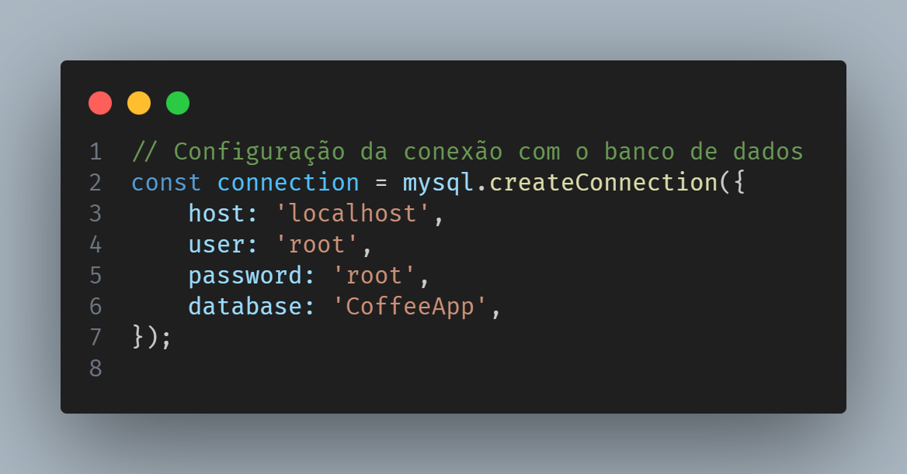

CoffeeApp
CoffeeApp é uma aplicação para gerenciamento de produtos relacionados ao café.

# GIF


Instalação
Para começar a usar o CoffeeApp, siga os passos abaixo:

Clone o repositório para o seu ambiente local:
```bash
git clone https://github.com/sr-scanor/CoffeeApp
cd CoffeeApp
````
Instale as dependências do projeto:
````bash
npm install

````
Crie o banco de dados executando os seguintes comandos no MySQL:
````bash
CREATE DATABASE CoffeeApp;
USE CoffeeApp;

CREATE TABLE users (
    id INT AUTO_INCREMENT PRIMARY KEY,
    username VARCHAR(255) NOT NULL,
    password VARCHAR(255) NOT NULL,
    cpf VARCHAR(14) NOT NULL,
    telefone VARCHAR(15) NOT NULL,
    email VARCHAR(255) NOT NULL,
    profileImage VARCHAR(255),
    created_at TIMESTAMP DEFAULT CURRENT_TIMESTAMP,
    UNIQUE (username, email)
);

CREATE TABLE products (
    id INT AUTO_INCREMENT PRIMARY KEY,
    userId INT,
    productName VARCHAR(255) NOT NULL,
    price DECIMAL(10, 2) NOT NULL,
    stock INT NOT NULL,
    description TEXT,
    categoryId INT NOT NULL,
    productImage VARCHAR(255),
    created_at TIMESTAMP DEFAULT CURRENT_TIMESTAMP,
    FOREIGN KEY (userId) REFERENCES users(id),
    FOREIGN KEY (categoryId) REFERENCES categories(id)
);

CREATE TABLE categories (
    id INT AUTO_INCREMENT PRIMARY KEY,
    name VARCHAR(255) NOT NULL,
    created_at TIMESTAMP DEFAULT CURRENT_TIMESTAMP
);
````
Conecte o banco de dados no código. (Adicione suas configurações de conexão ao arquivo server.js)



Inicie o projeto:
````bash
npx expo start
````

Contribuição
Contribuições são bem-vindas! Sinta-se à vontade para abrir uma issue ou enviar um pull request.

Licença
Este projeto está licenciado sob a Licença MIT - consulte o arquivo LICENSE para mais detalhes.


